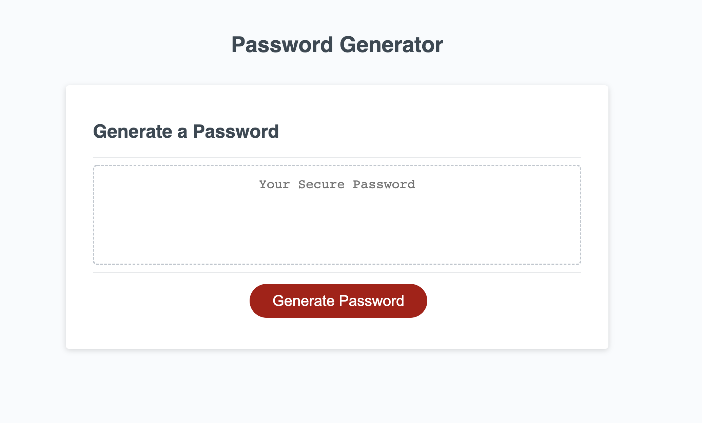

# Password Generator 

## Purpose 
Generate secure passwords that very in length and criteria 

## Problems Solved 
Setting the arrays was something that I could have done manually but I knew that you could code the values of the array to appear for you. I was able to figure this out after a few searches. As I was setting up the game I knew that I would run into the problem of adding all of the different criteria arrays to eachother at the end and you would get all of your lowercase next to each other and there would be no varity in the characters. I looked up a shuffle function and implemented it to make more secure passwords. 

## Lessons Learned 
* Try andd write as many functions as you can to make your code more DRY.
* How to set arrays with specific values 

## Challenges 
I used some functions to make my code DRY but I think that using objects instead of arrays would have made for a much more consice code. I also think using more loops could have been beneficial to reduce the lines that I repeated. 

## Built with 
* HTML 
* CSS 
* Javascript 

# Deployed Webiste 
https://clarkspencerc.github.io/secure-password-generator/

## Screenshots of website 

When you arrive at webiste 

Selecting length of password 

Selecting password criteria 

Verifying criteria 

Password successfully generated 

# Contributions and Resources 
* auto filled in arrays learned from : "https://javascript.plainenglish.io/create-an-array-of-alphabet-characters-in-javascript-with-this-simple-trick-930033079dd3"
* shuffel array learned from: https://www.codegrepper.com/code-examples/javascript/shuffle+items+in+an+array+javascript+mdn